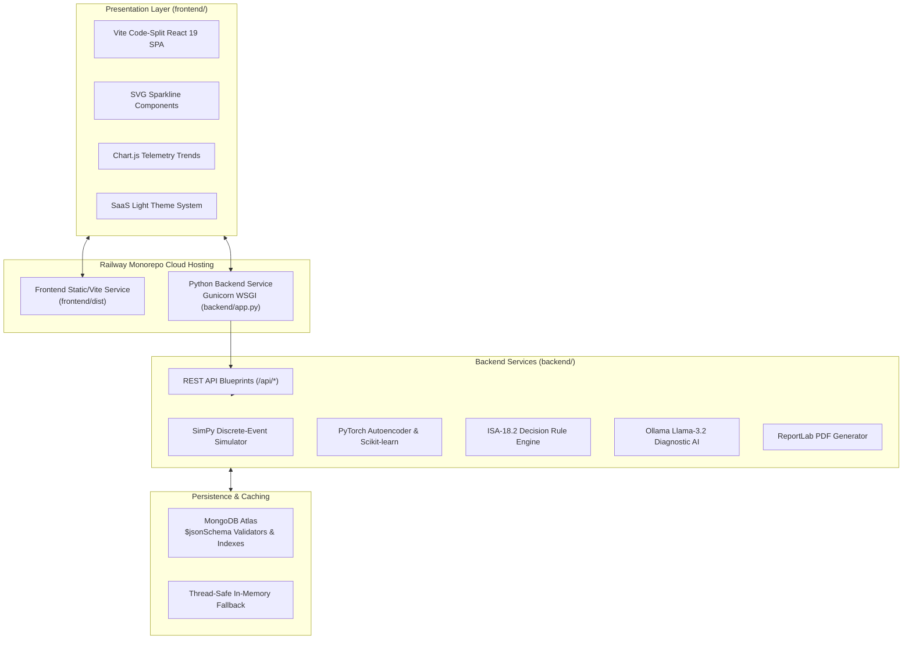

# Enterprise Architecture — Virtual Plant Operator AI SaaS

## 🏛️ System Architecture Overview

---

## ⚡ Architectural Highlights

1. **Monorepo Service Separation**: Decoupled Python Flask WSGI backend (`backend/`) and React 19 SPA (`frontend/`) optimized for independent Railway cloud deployment.
2. **Gunicorn Production Server**: Standalone Gunicorn WSGI application server (`gunicorn app:app --bind 0.0.0.0:$PORT`) running inside `backend/`.
3. **Enterprise Security & CORS**: Dynamic CORS origin evaluation supporting both local Vite development and production Railway frontend URLs.
4. **Machine Learning Anomaly Detection**: PyTorch Autoencoder and Scikit-learn model evaluation with automatic fallback rule overrides.
5. **Explainable AI (XAI)**: Ollama Llama-3.2 local model diagnostic engine with configurable `OLLAMA_BASE_URL` environment variables.
